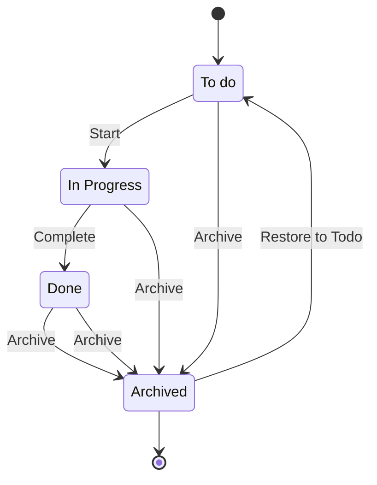

# Task Micro

## Overview
`task-micro` is a microservice application designed to handle task management operations. This project uses TypeScript, Node.js, Express, PostgreSQL, Docker, and several other tools and libraries to provide a robust and scalable backend service.

### Tasks state flow



## Technical Features
- RESTful API for task management
- Swagger documentation
- Dockerized environment for development and production
- Comprehensive testing setup with Vitest
- Debugging capabilities with `ts-node-dev` and Vitest
- Environment variable management with `dotenv`

## Prerequisites
- Node.js (>= 20.13.1)
- Docker
- Docker Compose
- Node Version Manager

## Installation
1. Clone the repository:
   ```sh
   git clone https://github.com/yourusername/task-micro.git
   cd task-micro
   ```

2. Install the dependencies:
   ```sh
   nvm install
   npm install
   ```

3. Set up environment variables:
   - Create a `.env` file in the root directory of the project, you can see the file `.env.example` to get more information and reference of the correct values.
   - Add the following variables to the `.env` file:
     ```sh
     NODE_ENV=development
     DATABASE_USER=your_database_user
     DATABASE_PASSWORD=your_database_password
     DATABASE_NAME=your_database_name
     API_PORT=8080
     VERSION=1.0.0
     ```
    - Note: this is the same name as the one in the docker-compose.yaml file section for database, when executed outside of the container this value should change to reach the postgreSQL database (eg. localhost).

## Scripts
- **Start the application**:
  ```sh
  npm run start
  ```

- **Start the application in debug mode**:
  ```sh
  npm run start:debug
  ```
  Once executed you'll need to attach the debuger.

- **Format the code**:
  ```sh
  npm run format
  ```

- **Run unit tests**:
  ```sh
  npm run test
  ```

- **Run unit tests in debug mode**:
  ```sh
  npm run test:debug
  ```
  Once executed you'll need to attach the debuger.

- **Run end-to-end tests**:
  ```sh
  npm run e2e
  ```

## Docker Setup
1. Ensure Docker and Docker Compose are installed on your machine.
2. Start the Docker containers:
   ```sh
   npm run up
   ```
3. To stop the Docker containers:
   ```sh
   npm run down
   ```

## Project Structure
- `src/`: Contains the source code for the application.
- `tests/`: Contains the test cases for the application.
- `.config/`: Contains configuration files, such as `init.sql` for initializing the database.
- `docker-compose.yaml`: Docker Compose configuration for setting up the application and database services.

## Technologies Used
- **TypeScript**: For type-safe JavaScript development.
- **Node.js**: JavaScript runtime for building the backend.
- **Express**: Web framework for building RESTful APIs.
- **PostgreSQL**: Relational database for storing task data.
- **Docker**: Containerization tool for consistent development and production environments.
- **Vitest**: Testing framework for unit and end-to-end tests.
- **Prettier**: Code formatter for consistent code style.
- **Winston**: Logging library.
- **dotenv**: Environment variable management.

## Contributing
1. Fork the repository.
2. Create a new branch (`git checkout -b feature-branch`).
3. Make your changes.
4. Commit your changes (`git commit -am 'Add new feature'`).
5. Push to the branch (`git push origin feature-branch`).
6. Open a Pull Request.
