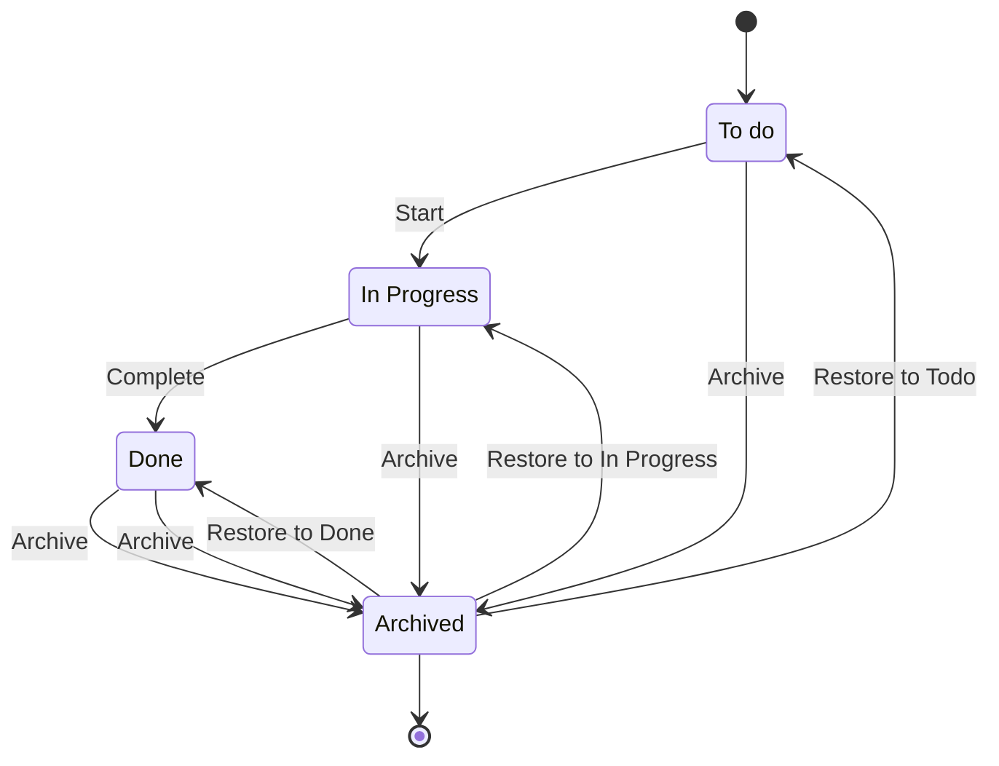

```mermaid
stateDiagram-v2
    state "To do" as Todo
    state "In Progress" as InProgress
    state "Done" as Done
    state "Archived" as Archived

    [*] --> Todo
    Todo --> InProgress: Start
    InProgress --> Done: Complete
    Done --> Archived: Archive
    Archived --> [*]

    Todo --> Archived: Archive
    InProgress --> Archived: Archive
    Done --> Archived: Archive
    Archived --> Todo: Restore to Todo
    Archived --> InProgress: Restore to In Progress
    Archived --> Done: Restore to Done
```